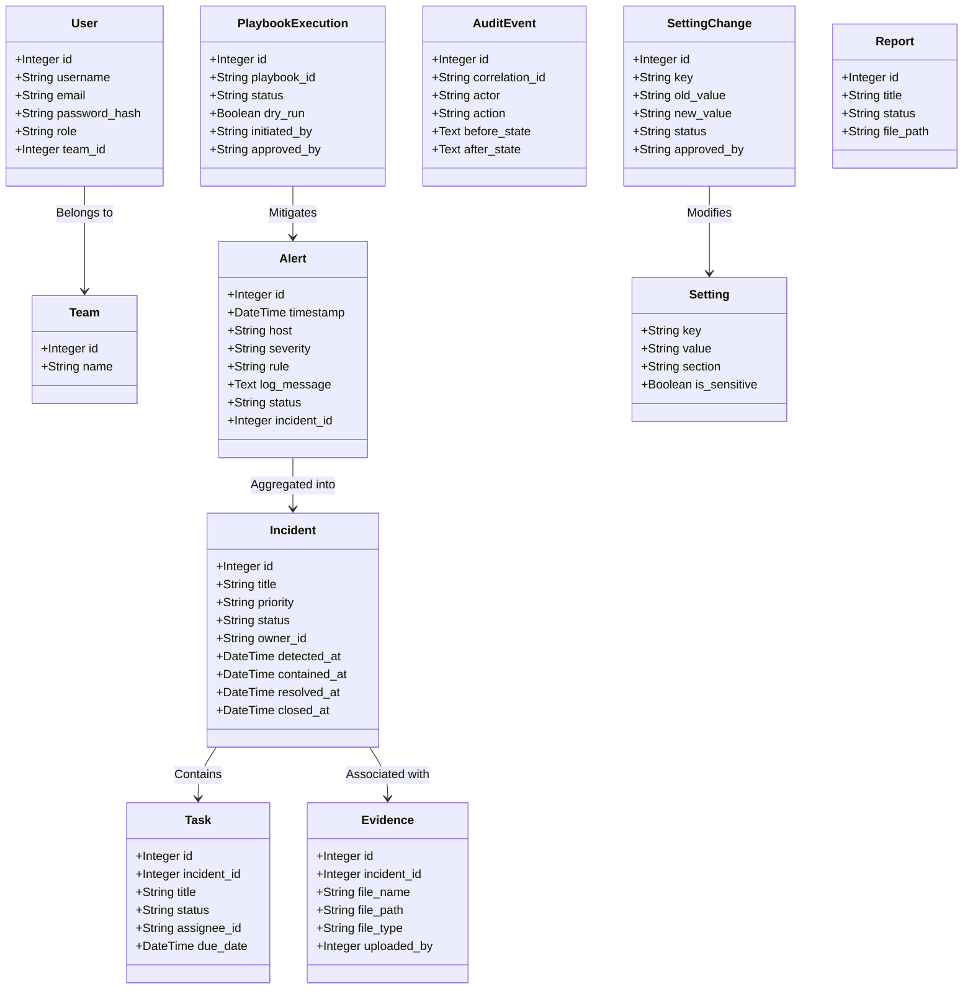

# GotXA — System Architecture & Design Report

This report provides a comprehensive, production-grade technical overview of the GotXA platform's architecture. It outlines the multi-server network topology, relational database schema, role-based access control, immutable audit trail, industrial Modbus TCP simulators, SCADA HMI gateway, and the SOAR playbook containment engine.

---

## 🗺️ 1. Multi-Server Network Architecture

The GotXA environment is split into three logically segmented network zones to simulate a modern industrial corporate IT and operational technology (OT) setup.

```
                          ┌──────────────────────────┐
                          │   API Gateway (Nginx)    │
                          │   Public Ports 80 / 443  │
                          └────────────┬─────────────┘
          ┌────────────────────────────┼────────────────────────────┐
          ▼                            ▼                            ▼
  SIEM/SOAR Frontend         Corporate Portal UI            SCADA HMI UI
  (React · Port 80)           (React · Port 80)           (React · Port 80)
          │                            │                            │
          └────────────────────────────┼────────────────────────────┘
                                       ▼
                             ┌───────────────────┐
                             │  Backend REST API │
                             │ Flask · Port 5000 │
                             └─────────┬─────────┘
                       ┌───────────────┼───────────────┐
                       ▼               ▼               ▼
                 PostgreSQL          Redis       Celery Worker
                 (Port 5432)      (Port 6379)     (PDF Engine)
```

### Gateway Routing Map
The outer Nginx Gateway (`api-gateway`) acts as a single ingress reverse-proxy. It distributes HTTP request traffic to the internal containers using the following routing map:

| Public URL Path | Destination Container | Port | Description |
| :--- | :--- | :--- | :--- |
| `/` | `siem-soar-frontend` | `80` (internal) | Main SOC monitoring console. |
| `/corp` | `corp-portal-frontend` | `80` (internal) | Business portal landing page. |
| `/scada` | `scada-frontend` | `80` (internal) | Industrial HMI process gauges. |
| `/api/` | `gotxa-backend` | `5000` | REST API routes. |

---

## 🗄️ 2. Relational Database Schema & Models

The primary persistent data layer is driven by PostgreSQL and mapped via SQLAlchemy ORM models (`backend/app/models.py`). To ensure high-throughput query performance, critical columns like `status`, `severity`, `host`, and `created_at` are indexed.



### Detailed Schema Definitions
1.  **`User`**: System accounts. Fields include role membership (`admin`, `soc_manager`, `analyst`) and team references.
2.  **`Team`**: Organizes analyst units. Enforces team-based multi-tenancy access controls.
3.  **`Alert`**: Raw log alerts. Tracks the alert lifecycle (`open` → `investigating` → `resolved` → `dismissed`).
4.  **`Incident`**: Aggregated security cases with strict state transition validations.
5.  **`Task`**: Granular assignments within incidents, specifying ownership and deadlines.
6.  **`Evidence`**: Metadata and file system paths for uploaded forensic logs and screenshots.
7.  **`PlaybookExecution`**: Tracks the run history, dry-run flags, and approval steps of SOAR playbooks.
8.  **`AuditEvent`**: Append-only log tracking mutations with correlation IDs, IP addresses, and user agents.
9.  **`Setting`**: Dynamic configuration store. High-risk entries (e.g., firewall policy) trigger validation checks.
10. **`SettingChange`**: Audit history of settings edits requiring multi-factor manager approval.
11. **`Report`**: Compiles generated reports (Executive Summary, NIST, Post-Incident Review).

---

## 🔐 3. Authentication & Role-Based Access Control (RBAC)

The auth manager (`backend/app/auth.py`) implements a zero-trust architecture enforcing authorization controls before executing any backend logic.

### Role Mapping
The platform supports three distinct roles, mapped as follows:

| Role | Core Privileges | Restrictions |
| :--- | :--- | :--- |
| **`admin`** | Full access. Settings management, user control, report compilation. | None. |
| **`soc_manager`** | Incident assignment, playbook triggering, audit trail reviews. | Cannot approve setting modifications or high-risk OT containment actions without re-auth. |
| **`analyst`** | Alert investigations, ticket generation, adding incident evidence. | Cannot close incidents, execute containment playbooks, or access system configuration sections. |

### RBAC Decorators
*   **`@authenticate`**: Extracts and validates the identity from the `Authorization: Bearer <token>` or `X-User-ID` header. Auto-provisions a default admin in demo environments.
*   **`@require_permission(action)`**: Evaluates user permissions against the RBAC permissions matrix. Blocks unauthorized calls with a `403 Forbidden` response.
*   **`AuthContext`**: Per-request thread-local context tracking the user's role and team, automatically filtering queries so analysts can only access their assigned division's data.

---

## 📝 4. Immutable Audit Logging

Every state mutation in the database is tracked by a dedicated audit logger (`backend/app/audit.py`). 

*   **Append-Only Enforcement**: The `audit_events` table lacks update and delete pathways at the database engine level, ensuring log integrity.
*   **Correlation Tracking**: Multi-step actions (e.g., Alert → Incident → Playbook Execution) share a single UUID correlation ID across API routes and log files.
*   **State Diffs**: Mutation records capture detailed `before_state` and `after_state` JSON snapshots, facilitating forensic reviews of setting alterations or incident closures.

---

## ⚡ 5. High-Fidelity Industrial OT PLC Simulation

The operational technology zone models a physical refinery plant running Modbus TCP servers (`modbus_plc_server.py`).

```
                    ┌────────────────────────────┐
                    │     SCADA Dashboard UI     │
                    │      (2s Live Refresh)     │
                    └─────────────┬──────────────┘
                                  ▼
                    ┌────────────────────────────┐
                    │     SCADA REST Gateway     │
                    │      Port 5002 /api        │
                    └─────────────┬──────────────┘
                                  ▼
           ┌──────────────────────┴──────────────────────┐
           ▼                                             ▼
  PLC 1 (Refinery Heater)                       PLC 2 (Mixer Tank)
     Modbus TCP: 5003                              Modbus TCP: 5004
  - Holding Reg 40001: Temp                     - Holding Reg 40003: Flow
  - Holding Reg 40002: Valve                    - holding Reg 40004: Speed
```

### Autonomous Simulators
The servers simulate physical behaviors with dynamic process noise:
*   **PLC-1 (Port 5003)**:
    *   **Holding Register 40001**: Crude Oil Heater Temperature. Simulates process noise around a baseline of 180°C (range: 150-220°C).
    *   **Holding Register 40002**: Pressure Control Valve. Simulates process noise around a baseline of 50 PSI (range: 30-80 PSI).
*   **PLC-2 (Port 5004)**:
    *   **Holding Register 40003**: Chemical Mixer Flow Rate. Simulates noise around a baseline of 50 L/min (range: 20-100 L/min).
*   **Process Fluctuations**: Pymodbus run loops adjust register values by ±0.5-1.0% per simulation loop, logging instrumentation logs in structured JSON format.

---

## 🌐 6. SCADA HMI Gateway & Dashboards

*   **Async Client Worker**: The SCADA gateway service (`scada_gateway.py`) maintains thread-safe connection pools to the Modbus TCP PLCs.
*   **2-Second Polling Loop**: The daemon queries PLC registers every 2 seconds, caching values to prevent TCP socket starvation.
*   **REST Aggregator**: Exposes unified telemetry data at `GET /api/modbus`, yielding structured JSON detailing register values, threshold statuses (Green, Orange, Red), and PLC health metrics.
*   **Dynamic SVG HMI**: The SCADA React Dashboard renders HMI process diagrams (gauges, heaters, mixers) driven by the gateway's REST feed.

---

## 🤖 7. SOAR Response Playbook Engine

The SOAR engine (`backend/app/api_v1_actions.py`) closes the security loop by automating containment responses.

### Playbook Modes
*   **Safe Simulation Mode (`SOAR_REAL_MODE=false`)**: Simulates network latencies using thread sleep delays, logs the commands, and generates database success audit records.
*   **Active Defense Mode (`SOAR_REAL_MODE=true`)**: Executes actual system commands:
    *   **`iptables` Packet Filtering**: Blocks attacking IPs via command-line execution (`iptables -A INPUT -s <ip> -j DROP`).
    *   **Docker Socket Isolation**: Uses the Docker socket wrapper (`/var/run/docker.sock`) to disconnect compromised containers from networks named `corp` or `corporate`.
    *   **Service Reboots**: Automatically re-provisions crashed telemetry collectors or web hosts by sending container restart commands to the Docker daemon.

### Guardrails & Safety Controls
*   **60-Second Cooldown**: The engine checks the `soar_actions` table before firing containment playbooks. If an action on the same target was executed within the last 60 seconds, the run is logged as `[RATE LIMITED]` and skipped.
*   **Whitelisted Networks**: The engine prevents lockout accidents by matching IP block targets against a whitelist containing loopback (`127.0.0.1`) and default Docker bridges/subnets.
*   **Status Escalation**: When all containment steps run successfully, the source alert is marked as `Resolved`. If any task fails, the alert remains in `Investigating` status to prompt manual analyst intervention.
