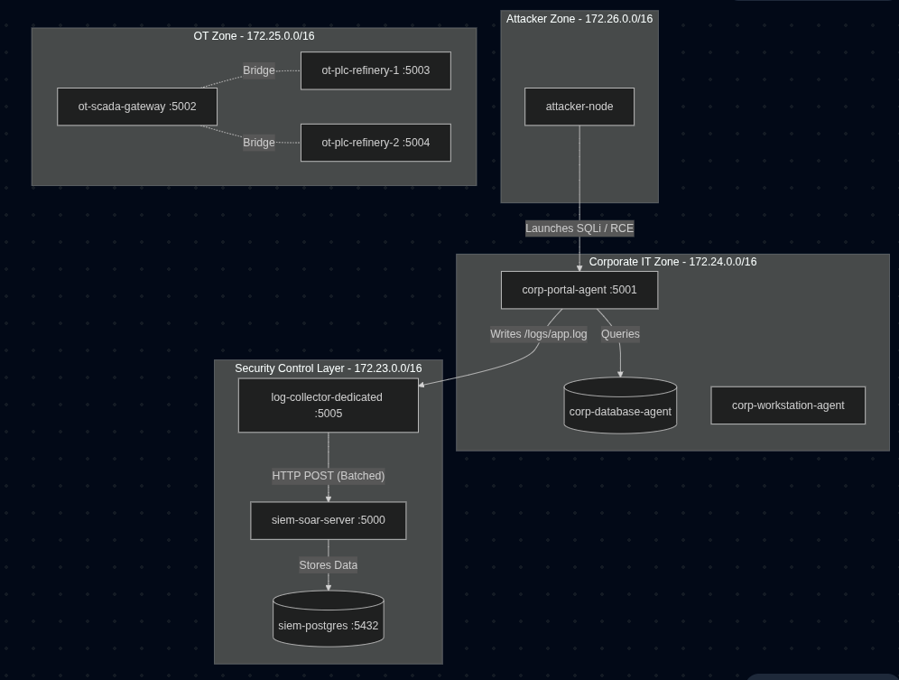
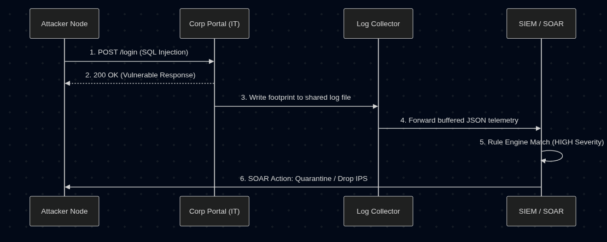
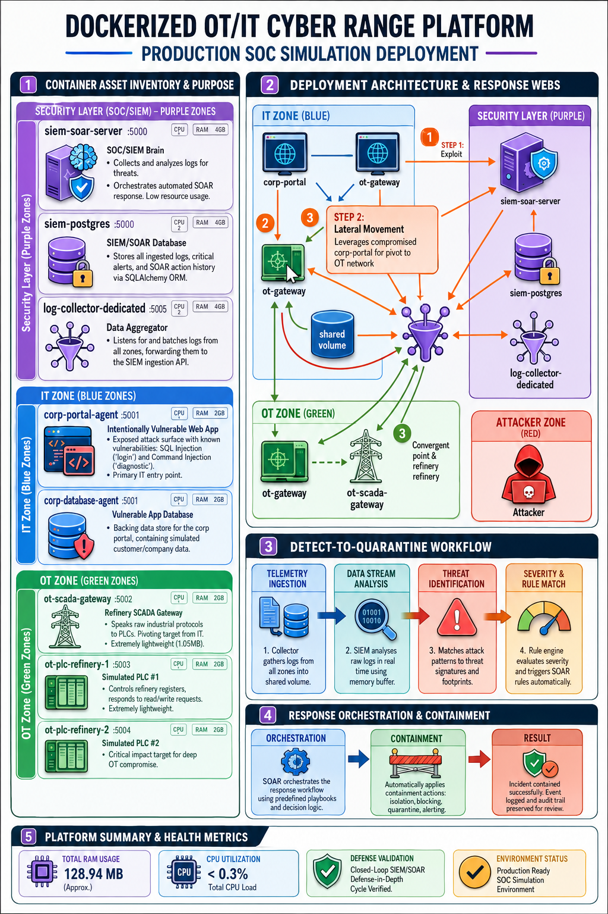

# Vulnerable Cyber Range — Critical Infrastructure SOC Simulation


*A self-contained Docker environment simulating a critical infrastructure organization (e.g., a refinery like NRL/OIL), designed to launch real attacks and demonstrate automated detection and response.*

## Core Concepts

- **SIEM (Security Information and Event Management)** — collects and analyzes logs from across the network to detect threats. Here: `siem-soar-server` + `siem-postgres`.
- **SOAR (Security Orchestration, Automation, and Response)** — automatically acts on detected threats (e.g. blocking an attacker's IP) instead of waiting on a human analyst. Built into `siem-soar-server`.
- **Cyber Range** — a safe, isolated environment with *real* vulnerable software (not fake/simulated logs) so real attacks can be launched and really detected/defended against.
- **IT/OT Split** — reflects real critical infrastructure: a **Corporate IT zone** (office systems, the usual attack surface) and an **Operational Technology (OT) zone** (industrial control systems / SCADA / PLCs that run the physical plant). Compromising IT and pivoting into OT is the real-world nightmare scenario this range is built to model.

---

## 🏗️ Architecture & Network Zones


*(Above: High-level overview of the isolated subnets and container routing)*

| Zone | Docker Network | Purpose |
|---|---|---|
| Security Control Layer | `secure_net` (172.23.0.0/16) | Detection, storage, response — the "brain" |
| Corporate IT Zone | `corporate_net` (172.24.0.0/16) | Office/business systems — intentionally vulnerable, the main attack surface |
| OT Zone | `ot_net` (172.25.0.0/16) | Simulated refinery floor — ICS/SCADA/PLC devices |
| Attacker Zone | `attacker_net` | Isolated box to launch attacks from |

---

## 📦 Containers

### Security Control Layer
| Container | Role |
|---|---|
| `siem-soar-server` | Flask app — dashboard, detection rules, alerting, automated response (IP isolation/quarantine). Port `5000`. |
| `siem-postgres` | Stores logs & alerts (via SQLAlchemy ORM). |
| `log-collector-dedicated` | Watches for logs from source containers and forwards them to the SIEM's ingest API. |

### Corporate IT Zone
| Container | Role |
|---|---|
| `corp-portal-agent` | Intentionally vulnerable web app — SQL injection (`/login`) and command injection/RCE (`/diagnostic`). Port `5001`. |
| `corp-database-agent` | Backing database for the corporate portal. |
| `corp-workstation-agent` | Simulated employee machine (Debian) — a lateral-movement/pivot target. |

### OT Zone
| Container | Role |
|---|---|
| `ot-scada-gateway` | Simulated SCADA gateway, speaks a raw industrial protocol (not HTTP). Port `5002`. |
| `ot-plc-refinery-1` | Simulated PLC — responds to register read/write requests. Port `5003`. |
| `ot-plc-refinery-2` | Second simulated PLC. Port `5004`. |

### Attacker Zone
| Container | Role |
|---|---|
| `attacker-machine` | Isolated box for launching real attack scripts against `corp-portal-agent`. |

---

## ⚔️ The Closed-Loop Defense Demo


*(Above: The lifecycle of an exploit being caught and mitigated by the SOAR engine)*

```text
attacker-machine
      │  (SQL injection / RCE attempt)
      ▼
corp-portal-agent  ──writes log──▶  log-collector-dedicated
                                          │  (HTTP POST)
                                          ▼
                                  siem-soar-server:5000/api/v1/ingress
                                          │  (rule match, HIGH severity)
                                          ▼
                                     SOAR auto-response
                                          │  (isolate/quarantine)
                                          ▼
                                  attacker IP blocked
```
# This technical infographic is a working diagram of GotXA SOC:
- **Asset Inventory:** Detailed descriptions of every functional container from your deployment, explaining their specific roles, port numbers, and low resource usage.
- **Deployment Architecture:** A map of the three primary network zones—Corporate IT, OT Refinery, and the Security Control Layer—showing web-like connectivity between devices, including the central role of the dedicated log collector.
- **Closed-Loop Attack Simulation:** A clear, numbered trace of how an IT-to-OT pivot works in practice. This path follows an attack from the IT Corporate portal through the SCADA gateway to the refinery PLCs, and then shows how the SIEM and SOAR engines automatically detect and mitigate the threat by quarantining the attacker's IP.


