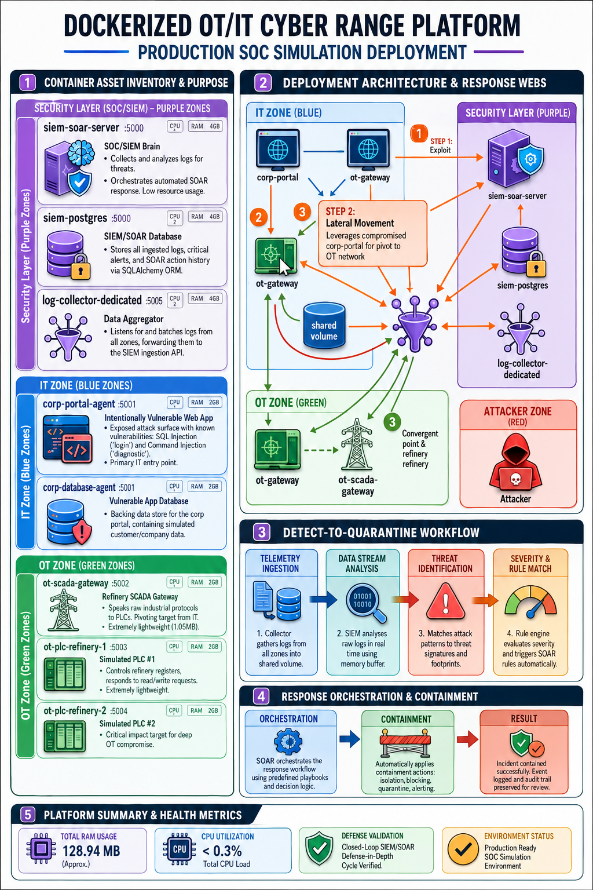

# GotXA — Critical Infrastructure SOC Simulation

A self-contained platform that simulates a critical-infrastructure security operations center (refinery / OT environment). It combines SIEM monitoring, SOAR automated response, corporate IT and SCADA/OT dashboards, and an optional cyber-range layer for launching real attacks against intentionally vulnerable services.

<!-- IMAGE: Project cover / hero banner — replace div below with  -->
<p align="center">
  <div style="width:100%; height:280px; border:2px dashed #aaa; display:flex; align-items:center; justify-content:center; color:#888; font-family:sans-serif;">
     
  </div>
</p>

---

## Contributors

| Name | Role | Link |
|------|------|------|
| Syed Yashin Hussain | Project lead & SIEM architect | [GitHub](https://github.com/Gibberlin) |
| Avirup Roy | Lead SOAR architect & documentation | [GitHub](https://github.com/aviruproyy-hub) |
| Antara Deb | SIEM contributor, detection rules, log analysis | [GitHub](https://github.com/antaradeb0045) |
| Community | Improvements, testing, issue fixes | — |

---

## Core Concepts

| Concept | What it means in GotXA |
|---------|------------------------|
| **SIEM** | Collects and analyzes logs from across the environment to detect threats. Implemented in the backend API, legacy `siem_server.py`, and the SIEM dashboard UI. |
| **SOAR** | Automatically responds to detected threats (IP block, host isolation, service restart, etc.) via playbook execution. Implemented in `backend/app/api_v1_actions.py`, legacy `app/soar_engine.py`, and the SOAR dashboard tab. |
| **Cyber Range** | Isolated environment with real vulnerable software and attack scripts so exploits produce real logs and trigger real detections. Source files in repo root and `pentesting_scripts/`. |
| **IT / OT Split** | Corporate IT zone (office systems, attack surface) vs. OT zone (SCADA, PLCs, refinery simulation). Reflected in network design, SCADA HMI, and Modbus PLC servers. |

---

## Quick Start

```bash
# Clone and enter the project
cd GotXA

# Build and start the full stack (Docker Compose)
docker-compose build
docker-compose up -d

# Verify services
curl http://localhost/health          # API gateway
curl http://localhost/api/health      # Backend API
```

| Application | URL |
|-------------|-----|
| SIEM / SOAR Dashboard | http://localhost/ |
| Corporate Portal | http://localhost/corp |
| SCADA HMI | http://localhost/scada |
| REST API | http://localhost/api/ |
| Backend (direct) | http://localhost:5000 |
| PostgreSQL (dev) | localhost:5432 |

Copy `.env.example` to `.env` and adjust credentials before production use.

---

## Architecture

<!-- IMAGE: High-level architecture diagram — replace div below with  -->
<p align="center">
  <div style="width:100%; height:360px; border:2px dashed #aaa; display:flex; align-items:center; justify-content:center; color:#888; font-family:sans-serif;">
    [ Architecture Diagram — add ./images/architecture.png ]
  </div>
</p>

```
                         ┌─────────────────────────┐
                         │     API Gateway (Nginx)  │
                         │     Port 80 / 443        │
                         └───────────┬─────────────┘
           ┌────────────────────────┼────────────────────────┐
           │                        │                        │
           ▼                        ▼                        ▼
   SIEM/SOAR Frontend      Corp Portal Frontend      SCADA Frontend
   (React + Nginx)         (React + Nginx)           (React + Nginx)
           │                        │                        │
           └────────────────────────┼────────────────────────┘
                                    ▼
                          ┌──────────────────┐
                          │  Backend API      │
                          │  Flask · Port 5000│
                          └────────┬─────────┘
                    ┌───────────────┼───────────────┐
                    ▼               ▼               ▼
              PostgreSQL          Redis         Celery Worker
              (siem_db)        (cache/broker)   (PDF reports)
```

**Gateway routing** (`webservers/api-gateway/nginx.conf`):

| Path | Destination | Purpose |
|------|-------------|---------|
| `/` | `siem-soar-frontend` | Main security dashboard |
| `/corp` | `corp-portal-frontend` | Corporate login & admin UI |
| `/scada` | `scada-frontend` | Industrial HMI |
| `/api/` | `backend:5000` | REST API |

---

## What GotXA Does — Complete Feature Map

Everything the project provides, and where it lives.

### User Interfaces

| Feature | Description | Where |
|---------|-------------|-------|
| SIEM overview dashboard | KPI cards, alert counts, host metrics, live refresh | `frontend/siem_dashboard/src/pages/SiemDashboard.jsx` → served at `/` |
| SOAR response panel | Active mitigations, action history, playbook catalog | `frontend/siem_dashboard/src/pages/SOARDashboard.jsx` → tab in SIEM app |
| Raw log stream viewer | Live scrolling log feed with pause/clear controls | `frontend/siem_dashboard/src/pages/RawLogs.jsx` → tab in SIEM app |
| Corporate login portal | Authenticated login form (demo credentials shown) | `frontend/corp_portal/src/pages/CorpLogin.jsx` → `/corp` |
| Corporate admin dashboard | Business metrics, recent activity, user session | `frontend/corp_portal/src/pages/CorpDashboard.jsx` → `/corp` (after login) |
| SCADA HMI | Real-time PLC gauges (temperature, pressure, flow), alarms, online status | `frontend/scada_dashboard/src/pages/SCADAHmi.jsx` → `/scada` |
| Legacy unified frontend | Older combined React app (superseded by split frontends) | `frontend/src/` |
| Legacy static dashboard | HTML/CSS dashboard served by Flask | `app/static/dashboard/` |
| Log collector live UI | Terminal-style raw log stream (legacy stack) | `log_collector.py` (embedded HTML dashboard) |

### Backend API — Read Operations

| Feature | Endpoint | Where |
|---------|----------|-------|
| Dashboard KPIs & charts | `GET /api/overview` | `backend/app/api_v1.py` |
| Dashboard aggregate data | `GET /api/dashboard-data` | `backend/app/api_v1.py` |
| Raw log streaming | `GET /api/raw-stream` | `backend/app/api_v1.py` |
| List / filter alerts | `GET /api/alerts` | `backend/app/api_v1.py` |
| Alert detail & context | `GET /api/alerts/<id>` | `backend/app/api_v1.py` |
| List / filter incidents | `GET /api/incidents` | `backend/app/api_v1.py` |
| Incident detail | `GET /api/incidents/<id>` | `backend/app/api_v1.py` |
| User capabilities (RBAC) | `GET /api/capabilities` | `backend/app/api_v1.py` |
| Audit trail | `GET /api/audit-events` | `backend/app/api_v1.py` (admin only) |
| Incident summary stats | `GET /api/incidents/summary` | `backend/app/api_v1_extended.py` |
| Incident tasks | `GET /api/incidents/<id>/tasks` | `backend/app/api_v1_extended.py` |
| Data source metrics | `GET /api/data-sources/metrics` | `backend/app/api_v1_extended.py` |
| Threat intel feeds | `GET /api/threat-intelligence/feeds` | `backend/app/api_v1_extended.py` |
| JIT access sessions | `GET /api/access/jit-sessions` | `backend/app/api_v1_extended.py` |
| Overview metrics (consolidated) | `GET /api/overview/metrics` | `backend/app/api_v1_consolidated.py` |
| Detection rule versions | `GET /api/detection-rules/<id>/versions` | `backend/app/api_v1_consolidated.py` |
| Settings change history | `GET /api/settings/history` | `backend/app/api_v1_consolidated.py` |
| Asset export (CSV) | `GET /api/assets/export` | `backend/app/api_v1_consolidated.py` |
| List reports | `GET /api/reports` | `backend/app/api_v1_reports.py` |
| Report status / download | `GET /api/reports/<id>`, `/status`, `/download` | `backend/app/api_v1_reports.py` |
| SOAR action catalog | `GET /api/v1/soar/actions` | `backend/app/api_v1_actions.py` |
| SOAR execution history | `GET /api/v1/soar/history` | `backend/app/api_v1_actions.py` |
| Platform settings | `GET /api/settings` | `backend/app/api_v1_actions.py` |
| Health check | `GET /health` | `backend/main.py` |
| API status | `GET /api/status` | `backend/main.py` |

### Backend API — Write / Action Operations

| Feature | Endpoint | Where |
|---------|----------|-------|
| Bulk assign alerts | `POST /api/alerts/bulk-assign` | `backend/app/api_v1_actions.py` |
| Suppress alert | `POST /api/alerts/<id>/suppress` | `backend/app/api_v1_actions.py` |
| Update alert status | `PUT /api/alerts/<id>/status` | `backend/app/api_v1_actions.py` |
| Create incident | `POST /api/incidents` | `backend/app/api_v1_actions.py` |
| Incident lifecycle (open → closed) | `PUT /api/incidents/<id>/status` | `backend/app/api_v1_actions.py` |
| Assign incident | `POST /api/incidents/<id>/assign` | `backend/app/api_v1_actions.py` |
| Link alert to incident | `POST /api/incidents/<id>/link-alert` | `backend/app/api_v1_actions.py` |
| Execute SOAR playbook | `POST /api/v1/soar/execute` | `backend/app/api_v1_actions.py` |
| Update platform settings | `PUT /api/settings` | `backend/app/api_v1_actions.py` |
| Create incident task | `POST /api/incidents/<id>/tasks` | `backend/app/api_v1_extended.py` |
| Register log source | `POST /api/data-sources` | `backend/app/api_v1_extended.py` |
| Create / sync threat feed | `POST /api/threat-intelligence/feeds`, `/sync` | `backend/app/api_v1_extended.py` |
| Request / approve / revoke JIT session | `POST /api/access/jit-sessions`, `/approve`, `/revoke` | `backend/app/api_v1_extended.py` |
| Create containment request | `POST /api/containment-requests` | `backend/app/api_v1_consolidated.py` |
| Execute playbook (consolidated) | `POST /api/playbooks/<id>/executions` | `backend/app/api_v1_consolidated.py` |
| Test detection rule | `POST /api/detection-rules/<id>/test` | `backend/app/api_v1_consolidated.py` |
| Patch settings section | `PATCH /api/settings/<section>` | `backend/app/api_v1_consolidated.py` |
| Generate PDF report (async) | `POST /api/reports` | `backend/app/api_v1_consolidated.py` → `backend/app/tasks.py` |

### Security, Auth & Audit

| Feature | Description | Where |
|---------|-------------|-------|
| RBAC (3 roles) | `admin`, `soc_manager`, `analyst` with granular permissions | `backend/app/auth.py` |
| Demo auth header | `X-User-ID: admin` auto-provisions user | `backend/app/auth.py` |
| JWT bearer auth | Production token-based authentication | `backend/app/auth.py` |
| Immutable audit log | Every mutation recorded with correlation ID | `backend/app/audit.py` |
| Incident state machine | Validated lifecycle transitions | `backend/app/api_v1_actions.py` |
| Playbook approval workflow | Execution records with approval gates | `backend/app/models.py` → `PlaybookExecution` |

### Detection & SOAR Engine (Legacy Stack)

| Feature | Description | Where |
|---------|-------------|-------|
| Regex detection rules | Brute force, RCE, privilege escalation, network anomaly, etc. | `app/engine.py` |
| Rogue device detection | Alerts on IPs outside authorized subnets (172.23/24/25.x) | `app/engine.py` |
| Rule-to-playbook mapping | Auto-selects response by alert type | `app/soar_engine.py` |
| SOAR action types | IP block, container isolate, service restart, rate limit, credential lock | `app/soar_engine.py` |
| Log ingestion pipeline | POST logs → parse → store → evaluate rules → trigger SOAR | `app/api/ingress.py` |
| SOAR REST API (legacy) | Actions, stats, notifications, manual trigger | `app/api/soar_api.py` |
| Dashboard aggregation (legacy) | Stats, recent events, timeline | `app/api/dashboard.py` |

### Cyber Range — Attack Surface & Simulation

| Feature | Description | Where |
|---------|-------------|-------|
| Vulnerable corporate portal | SQL injection (`/login`) and command injection (`/diagnostic`) | `vulnerable_app.py` · `Dockerfile.vulnerable` |
| SQL injection attack script | Sends classic SQLi payloads to corp portal | `pentesting_scripts/attack_sqli.py` |
| Brute-force attack script | Repeated failed login attempts | `pentesting_scripts/attack_bruteforce.py` |
| RCE attack script | Command injection against diagnostic endpoint | `pentesting_scripts/attack_rce.py` |
| Log agent | Generates structured JSON logs and ships to SIEM ingress | `agent.py` · `Dockerfile.agent` |
| Log collector | Tails log directories, forwards to SIEM, serves raw stream UI | `log_collector.py` · `Dockerfile.collector` |
| Legacy SIEM server | Standalone Flask SIEM with PostgreSQL storage | `siem_server.py` · `Dockerfile.siem` |
| SCADA gateway | Polls Modbus PLCs every 2 s, exposes REST API | `scada_gateway.py` · `Dockerfile.scada` |
| Modbus PLC simulation | Refinery-1 (temp/pressure) & Refinery-2 (flow rate) | `modbus_plc_server.py` |
| Modbus REST endpoints (legacy) | `/api/modbus`, `/api/modbus/refinery-1`, `/api/modbus/refinery-2` | `app/wsgi.py` · `scada_gateway.py` |

### Background Processing & Reports

| Feature | Description | Where |
|---------|-------------|-------|
| Celery worker | Async task execution | `backend/celery_worker.py` · `docker-compose.yml` → `celery-worker` |
| PDF report generation | Renders SIEM reports to PDF on disk | `backend/app/tasks.py` · `backend/app/pdf_generator.py` |
| Report storage volume | Persisted report files | Docker volume `reports-data` |

### Data Layer

| Model / Store | Purpose | Where |
|---------------|---------|-------|
| `User`, `Team` | Accounts, roles, team membership | `backend/app/models.py` |
| `Alert` | Security alerts from detection | `backend/app/models.py` |
| `Incident`, `Task`, `Evidence` | Incident management lifecycle | `backend/app/models.py` |
| `PlaybookExecution` | SOAR run history & approvals | `backend/app/models.py` |
| `AuditEvent` | Immutable audit trail | `backend/app/models.py` |
| `Setting`, `SettingChange` | Platform configuration | `backend/app/models.py` |
| `Report` | Generated report metadata | `backend/app/models.py` |
| `LogSource` | Registered telemetry sources | `backend/app/models.py` |
| `ThreatIntelligenceFeed` | External threat feeds | `backend/app/models.py` |
| `JITSession` | Just-in-time privileged access | `backend/app/models.py` |
| `SystemMetric` | Platform health metrics | `backend/app/models.py` |
| PostgreSQL | Primary persistent store (`siem_db`) | `docker-compose.yml` → `siem-postgres` |
| Redis | Celery broker & result backend | `docker-compose.yml` → `redis` |

### Infrastructure & DevOps

| Feature | Description | Where |
|---------|-------------|-------|
| Docker Compose orchestration | Full multi-service stack | `docker-compose.yml` |
| API gateway | Rate limiting, reverse proxy, gzip, health checks | `webservers/api-gateway/` |
| SIEM frontend server | Nginx serving built React app | `webservers/siem-soar-frontend/` |
| Corp portal frontend server | Nginx serving built React app | `webservers/corp-portal-frontend/` |
| SCADA frontend server | Nginx serving built React app | `webservers/scada-frontend/` |
| Backend Docker image | Production Flask container | `backend/Dockerfile` |
| Celery Docker image | Worker container | `backend/Dockerfile.celery` |
| Environment template | Configurable secrets & ports | `.env.example` |
| Endpoint test script | Shell-based API smoke tests | `test_endpoints.sh` |
| GitHub Actions CI | Python build & test workflow | `.github/workflows/django.yml` |

---

## Docker Services (Current Stack)

| Container | Role | Port / Access |
|-----------|------|---------------|
| `api-gateway` | Nginx reverse proxy, single entry point | `80`, `443` |
| `gotxa-backend` | Flask REST API (40+ endpoints) | `5000` (also via `/api/`) |
| `celery-worker` | Background PDF report generation | internal |
| `siem-soar-frontend` | SIEM/SOAR React dashboard | via gateway `/` |
| `corp-portal-frontend` | Corporate portal React app | via gateway `/corp` |
| `scada-frontend` | SCADA HMI React app | via gateway `/scada` |
| `siem-postgres` | PostgreSQL database | `5432` |
| `redis-cache` | Redis cache & Celery broker | internal |

> **Note:** The cyber-range containers (`corp-portal-agent`, `ot-scada-gateway`, `ot-plc-refinery-*`, `log-collector-dedicated`, `attacker-machine`) are defined in standalone Dockerfiles at the repo root and documented in `ARCHITECTURE_UPGRADE.md`. They represent the extended attack-simulation layer and can be run alongside or instead of parts of the current stack.

---

## Closed-Loop Defense Demo

<!-- IMAGE: Attack and defense flowchart — replace div below with  -->
<p align="center">
  <div style="width:100%; height:280px; border:2px dashed #aaa; display:flex; align-items:center; justify-content:center; color:#888; font-family:sans-serif;">
    [ Attack &amp; Defense Flowchart — add ./images/attack-flow.png ]
  </div>
</p>

```text
attacker-machine (or pentesting_scripts/)
      │  SQL injection / RCE / brute force
      ▼
corp-portal-agent (vulnerable_app.py)
      │  writes log entry
      ▼
log-collector-dedicated
      │  HTTP POST to SIEM ingress
      ▼
siem-soar-server / backend API
      │  rule match → HIGH severity alert
      ▼
SOAR engine (playbook execution)
      │  ip_block · container_isolate · service_restart
      ▼
attacker IP blocked / host quarantined
```

| Step | What happens | Where |
|------|--------------|-------|
| 1. Attack | Attacker sends exploit payloads | `pentesting_scripts/` → `vulnerable_app.py` |
| 2. Log | Vulnerable app logs the attempt | `vulnerable_app.py` → `/logs/corp-portal/` |
| 3. Collect | Collector tails logs and forwards | `log_collector.py` |
| 4. Ingest | SIEM receives and stores event | `app/api/ingress.py` or `backend/app/api_v1.py` |
| 5. Detect | Rule engine matches pattern | `app/engine.py` |
| 6. Alert | Alert created in database | `backend/app/models.py` → `Alert` |
| 7. Respond | SOAR playbook executes containment | `app/soar_engine.py` / `backend/app/api_v1_actions.py` |
| 8. Verify | Mitigation visible in SOAR dashboard | `frontend/siem_dashboard/src/pages/SOARDashboard.jsx` |

---

## IT-to-OT Pivot Path

<!-- IMAGE: IT-to-OT pivot / project execution poster — replace div below with  -->
<p align="center">
  <div style="width:100%; height:320px; border:2px dashed #aaa; display:flex; align-items:center; justify-content:center; color:#888; font-family:sans-serif;">
    [ IT-to-OT Pivot Diagram — add ./images/it-ot-pivot.png ]
  </div>
</p>

| Stage | Action | Where |
|-------|--------|-------|
| Compromise IT | Exploit corp portal (SQLi / RCE) | `vulnerable_app.py` · port `5001` |
| Lateral movement | Pivot to corp workstation | `corp-workstation-agent` (legacy compose) |
| Reach OT gateway | Access SCADA REST/Modbus bridge | `scada_gateway.py` · port `5002` |
| Manipulate PLCs | Read/write Modbus registers | `modbus_plc_server.py` · ports `5003`, `5004` |
| Monitor OT | Live HMI gauges and alarms | `frontend/scada_dashboard/` · `/scada` |
| Detect & contain | SIEM detects anomaly, SOAR isolates attacker | `app/engine.py` → `app/soar_engine.py` |

---

## Project Structure

```
GotXA/
├── backend/                    # Production Flask API (primary backend)
│   ├── app/                    # Models, auth, audit, API blueprints, Celery tasks
│   ├── main.py                 # Application factory
│   └── Dockerfile              # Backend container
├── frontend/
│   ├── siem_dashboard/         # SIEM + SOAR + raw logs UI
│   ├── corp_portal/            # Corporate login & dashboard
│   └── scada_dashboard/        # SCADA HMI
├── webservers/
│   ├── api-gateway/            # Nginx reverse proxy
│   ├── siem-soar-frontend/     # SIEM static file server
│   ├── corp-portal-frontend/   # Corp portal static file server
│   └── scada-frontend/         # SCADA static file server
├── app/                        # Legacy SIEM/SOAR engine & ingress API
├── pentesting_scripts/         # Attack simulation scripts
├── vulnerable_app.py           # Intentionally vulnerable corp portal
├── scada_gateway.py            # Modbus polling gateway
├── modbus_plc_server.py        # OT PLC simulation
├── log_collector.py            # Log tailing & forwarding
├── agent.py                    # Synthetic log generator agent
├── docker-compose.yml          # Current multi-server stack
└── .env.example                # Environment configuration template
```

---

## Documentation Index

| Document | Contents |
|----------|----------|
| [DEPLOYMENT_ARCHITECTURE.md](./DEPLOYMENT_ARCHITECTURE.md) | Full deployment guide & routing |
| [WEBSERVER_QUICK_START.md](./WEBSERVER_QUICK_START.md) | Gateway & frontend quick reference |
| [backend/README.md](./backend/README.md) | Backend API overview |
| [backend/API_ENDPOINTS.md](./backend/API_ENDPOINTS.md) | Complete endpoint reference |
| [backend/SETUP_GUIDE.md](./backend/SETUP_GUIDE.md) | Local & Docker setup |
| [backend/FRONTEND_INTEGRATION.md](./backend/FRONTEND_INTEGRATION.md) | React ↔ API integration |
| [SOAR_DOCUMENTATION.md](./SOAR_DOCUMENTATION.md) | SOAR engine & playbook mapping |
| [ARCHITECTURE_UPGRADE.md](./ARCHITECTURE_UPGRADE.md) | OT simulation & frontend decoupling |
| [API.md](./API.md) | SIEM/SOAR API specification |

---

## Replacing Placeholder Images

Each diagram above is a dashed-border rectangle. To add your own images:

1. Create an `images/` folder and add your files.
2. Replace each `<div>...</div>` block with a standard markdown image:

```markdown

```

| Placeholder | Suggested file |
|-------------|----------------|
| Cover banner | `images/cover.png` |
| Architecture diagram | `images/architecture.png` |
| Attack & defense flowchart | `images/attack-flow.png` |
| IT-to-OT pivot diagram | `images/it-ot-pivot.png` |

---

## License

See repository license file for terms of use.
