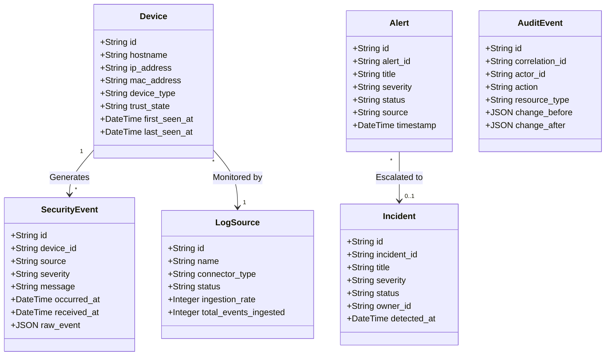

# GotXA — System Architecture & Design Specification

This document provides a comprehensive, production-grade technical specification of the GotXA platform architecture, encompassing multi-tier network topologies, parallel telemetry and log ingestion pipelines, dynamic machine auto-discovery, Modbus TCP industrial automation, relational database schemas, and SOAR containment workflows.

---

## 1. Multi-Tier Network & Service Topology

The GotXA environment models a segmented industrial enterprise with logically separated Corporate IT, Operational Technology (OT), Security Operations (SOC), and Infrastructure layers.

```
                                 ┌──────────────────────────┐
                                 │   API Gateway (Nginx)    │
                                 │   Public Ports 80 / 443  │
                                 └────────────┬─────────────┘
                 ┌────────────────────────────┼────────────────────────────┐
                 ▼                            ▼                            ▼
         SIEM/SOAR Frontend         Corporate Portal UI            SCADA HMI UI
         (React · Port 80)           (React · Port 80)           (React · Port 80)
                 │                            │                            │
                 └────────────────────────────┼────────────────────────────┘
                                              ▼
                                    ┌───────────────────┐
                                    │  Backend REST API │
                                    │ Flask · Port 5000 │
                                    └─────────┬─────────┘
                              ┌───────────────┼───────────────┐
                              ▼               ▼               ▼
                        PostgreSQL          Redis       Celery Worker
                        (Port 5432)      (Port 6379)     (PDF Engine)
                              ▲
                              │
               ┌──────────────┴──────────────┐
               │                             │
    ┌────────────────────┐        ┌────────────────────┐
    │  SCADA REST Gateway│        │ Parallel Collector │
    │   Port 5002 /api   │        │     Port 5006      │
    └──────────┬─────────┘        └──────────┬─────────┘
               │ (Modbus TCP)                │ (Log Tailers)
       ┌───────┴───────┐             ┌───────┴───────┐
       ▼               ▼             ▼               ▼
    PLC-1 (5003)    PLC-2 (5004)  /logs/corp/*    /logs/ot-*
```

### Ingress & Reverse Proxy Routing
The Nginx Reverse Proxy (`api-gateway`) provides uniform TLS termination, load balancing, and routing:

| Ingress Route | Target Container | Target Port | Functionality |
| :--- | :--- | :--- | :--- |
| `/` | `siem-soar-frontend` | `80` | Security operations dashboard, alerts, SOAR playbooks. |
| `/corp` | `corp-portal-frontend` | `80` | Corporate authentication portal and user workflows. |
| `/scada` | `scada-frontend` | `80` | Real-time industrial process visualization & HMI gauges. |
| `/api/` | `gotxa-backend` | `5000` | REST API endpoints for data, audit, devices, and cases. |

---

## 2. Parallel Telemetry & High-Throughput Log Pipeline

To eliminate bottlenecks in high-frequency OT/IT environments, all telemetry and log forwarding is decoupled into parallel, non-blocking asynchronous pipelines:

```
[PLC / Industrial Modbus Nodes] ──(Async Modbus)──> [SCADA Gateway Poller]
                                                           │
                                             (Non-blocking Queue)
                                                           ▼
                                               [SiemPublisher Workers]
                                                           │
                                                    (Parallel POST)
                                                           ▼
[Corporate Apps / Agents] ──(Real File Logs)──> [Parallel Log Collector] ──> [/api/ingest/events]
                                                                                      │
                                                                             (Celery / Worker Queue)
                                                                                      ▼
                                                                             [PostgreSQL DB Storage]
                                                                                      │
                                                                             [Real-Time Raw Stream]
```

### Pipeline Guarantees
1. **Zero Socket Starvation**: SCADA Modbus polling runs on dedicated asyncio event loops with connection pooling.
2. **Non-Blocking Ingestion**: The SIEM Publisher buffers telemetry in an in-memory thread-safe queue and flushes batches via `ThreadPoolExecutor` workers.
3. **Multi-Threaded Log Tailing**: `ParallelLogCollector` scans and tails log files across multiple directories concurrently without cross-blocking.

---

## 3. Dynamic Machine Auto-Discovery Architecture

The platform supports runtime discovery of new industrial assets and compute endpoints across three distinct layers:

### 3.1 SCADA Dynamic Registry
*   The `ModbusPoller` maintains a dynamic machine registry (`poller.machines`).
*   New machines can be registered via `POST /api/scada/machines/register` or environment variables without server restart.
*   Once registered, the gateway dynamically instantiates an async polling coroutine (`poller.poll_machine`) and emits a `SCADA_MACHINE_DISCOVERY` security event.

### 3.2 Dynamic Log Collector File Watcher
*   The collector dynamically scans the `/logs` directory tree, automatically detecting newly created machine folders (e.g. `/logs/ot-plc-distillation/` or `/logs/corp-workstation-5/`).
*   Infers canonical hostname and device classification, and assigns a dedicated worker to tail new log files.

### 3.3 SIEM Automated Device Inventory
*   When incoming telemetry arrives at `/api/ingest/events`, the backend checks the `devices` table.
*   If uncataloged, it creates a `Device` record marked `untrusted`, records MAC/IP/hostname, infers `device_type` (PLC, SCADA, Web Server, Database, Workstation), and emits a `NEW_DEVICE_DETECTED` alert in the SIEM.

---

## 4. Relational Database Schema & Data Models

PostgreSQL serves as the primary relational database, mapped using SQLAlchemy ORM (`backend/app/models.py`):



---

## 5. Security & Role-Based Access Control (RBAC)

1. **Role Hierarchy**:
   *   `admin`: Full platform control, configuration modification, user management, and PDF report creation.
   *   `soc_manager`: Incident assignment, alert triage, approval of high-risk containment playbooks, and audit review.
   *   `analyst`: Log streaming, alert investigation, adding forensic evidence, and task management.
2. **Enforcement**:
   *   `@authenticate`: Validates identity from Bearer JWT or platform identity header.
   *   `@require_permission(action)`: Enforces fine-grained permission matrix before executing controller logic.
   *   `AuditLogger`: Automatically records immutable mutation events with UUID correlation tracking.

---

## 6. Industrial OT PLC Simulation & SCADA Control

*   **Refinery 1 (Port 5003)**:
    *   Holding Register `40001`: Temperature (0.1 °C scale). Operating envelope: 170.0–210.0 °C.
    *   Holding Register `40002`: Pressure (0.1 PSI scale). Operating envelope: 45.0–75.0 PSI.
*   **Refinery 2 (Port 5004)**:
    *   Holding Register `40003`: Flow Rate (0.1 L/min scale). Operating envelope: 25.0–80.0 L/min.
*   **Safety Threshold Alarms**: When process values breach operating bounds, PLCs and the SCADA Gateway raise `SCADA_ALARM` events and log `PROCESS_THRESHOLD_ALERT`.
*   **Actuator Control & Interlocks**: Commands (`set_temperature`, `set_flow_rate`, `emergency_stop`) are validated against safety min/max boundaries and audited in real time.

---

## 7. SOAR Automated Response & Active Containment

The SOAR engine (`backend/app/api_v1_actions.py`) provides automated and manual remediation workflows:

1. **Containment Playbooks**:
   *   `host_isolation`: Disconnects compromised containers from Docker bridge networks.
   *   `firewall_block`: Issues `iptables` drop rules against attacker source IPs.
   *   `service_restart`: Recovers failed services or reboots compromised applications.
2. **Safety Guardrails**:
   *   **60-Second Cooldown**: Prevents flapping or duplicate containment actions on the same target.
   *   **Subnet Whitelisting**: Protects gateway bridges, loopbacks, and core infrastructure from accidental lockout.
   *   **Two-Person Approval**: High-risk actions require explicit manager approval before execution.
